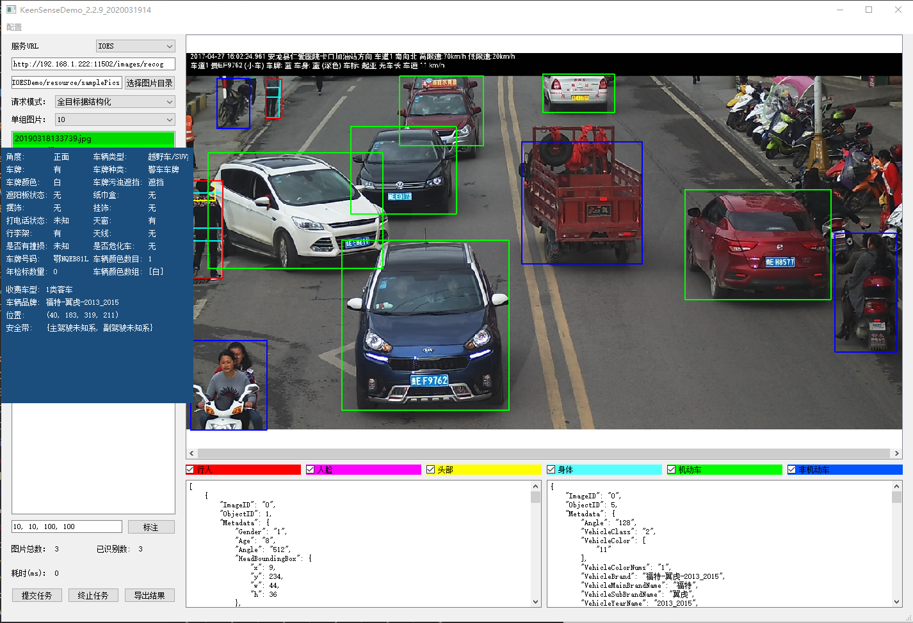

# IOESDemo
## 功能介绍
1. 图片预览
2. 对图片做base64后构造协议http json请求
3. 支持手动填入（x, y, w, h）参数，在预览的图片中画标识矩形框
4. 根据接收到的http json回复，在相应图片中使用不同颜色的矩形框标出图片中的不同目标
5. 鼠标悬浮于目标矩形框区域，显示预览窗口展示目标参数
6. 支持将所有图片的json回复信息导出到Excel表格

#### TODO
1. 预览图片自适应自窗口大小(or 支持放大缩小))
2. log to file
3. IAS 协议

## 开发环境
MacOS Mojave    
VSCode Version 1.38.1      
Python 3.7.3    
PyQT5  
QT Designer 5.12.3  

## 安装依赖
pip install PyQt5 -i https://pypi.douban.com/simple   
pip install PyQt5-tools -i https://pypi.douban.com/simple   
pip install openpyxl -i https://pypi.douban.com/simple  
pip install requests -i https://pypi.douban.com/simple  

## 通过python执行
python3 mainUI.py

## 打包为单个可执行文件
pyinstaller -F -w -i resource/logo.icns mainUI.py

## 效果预览

## refs:
https://www.riverbankcomputing.com/static/Docs/PyQt4/classes.html  
https://openpyxl.readthedocs.io/en/stable/  
